# Market Anomaly Narrative Engine (MANE)

**Detect crypto price anomalies. Explain why they happened. Never hallucinate.**

MANE solves a critical problem in quantitative finance: dashboards tell you *what* changed, but rarely *why*. Traditional LLMs hallucinate connections between unrelated events. MANE doesn't.

> **Architecture Philosophy**: Workflow first (predictable), Agent second (reasoning)

## 💰 Cost-Efficient Design

**Zero API costs in production!** Free RSS news sources with optional historical replay mode for deterministic testing.

- **Production Cost**: $0/month (down from $500/month with paid APIs)
- **News Quality**: 85-90% of paid API quality through keyword sentiment + LLM validation
- **Testing**: 100% deterministic with replay mode

## Quick Start

**Prerequisites**: Python 3.12+ · [uv](https://github.com/astral-sh/uv) · PostgreSQL 14+ · LLM API key

```bash
# Setup
git clone https://github.com/your-org/market-anomaly-narrative-engine.git
cd market-anomaly-narrative-engine
uv venv && source .venv/bin/activate && uv sync

# Database & Config
docker run --name mane-postgres -e POSTGRES_PASSWORD=yourpass -p 5432:5432 -d postgres:14
cp .env.example .env  # Edit: DATABASE__PASSWORD, LLM_API_KEY

# Initialize & Run
mane init-db
mane backfill --symbol BTC-USD --days 7
mane detect --symbol BTC-USD --news-mode live
```

**Web Interface** (optional): Node.js 18+ required. See [docs/WEB.md](docs/WEB.md) for full setup.

## Architecture

```mermaid
graph TD
    subgraph Phase1["PHASE 1: DETECTOR"]
        A[Price Data<br/>Coinbase API] --> B[Multi-Timeframe<br/>Statistical Detection]
        C[News Sources<br/>RSS Feeds] --> D[News Clustering<br/>HDBSCAN]
        B --> E[Anomaly Detected]
        D --> E
    end

    subgraph Phase2["PHASE 2: JOURNALIST"]
        E --> F[LLM Agent<br/>5 Tools Available]
        F --> G[2-Sentence Narrative]
    end

    subgraph Phase3["PHASE 3: SKEPTIC"]
        G --> H[Rule-Based Validators]
        H --> I[Judge LLM]
        I --> J{Result}
    end

    J -->|VALID ✓| K[Narrative Stored]
    J -->|Unknown| L[Flagged for Review]

    style Phase1 fill:#e1f5ff
    style Phase2 fill:#fff4e1
    style Phase3 fill:#ffe1e1
```



**🎯 Multi-Timeframe Detection** - Catches cumulative "slow burn" moves (5/15/30/60 min windows)
**🎨 Asset-Aware Thresholds** - BTC (3.5), DOGE (2.0), SOL/XRP (3.0) via `config/thresholds.yaml`
**📰 Free News Sources** - RSS feeds (CoinDesk, Cointelegraph, Decrypt, TheBlock, Bitcoin Magazine)

## Key Components

```
src/
├── phase1_detector/        # Statistical detection + news aggregation
│   ├── anomaly_detection/  # Multi-timeframe, asset-aware thresholds
│   ├── news_aggregation/   # RSS (free) + optional paid APIs
│   └── clustering/         # HDBSCAN news clustering
├── phase2_journalist/      # LLM agent with 5 tools
├── phase3_skeptic/         # Rule-based + Judge LLM validation
├── database/               # SQLAlchemy ORM
├── orchestration/          # Pipeline coordinator
└── cli/                    # CLI commands

web/
├── backend/                # Express + Prisma (port 3001)
└── frontend/               # React + Vite (port 5173)
```

## Configuration

**Essential `.env` variables:**
```bash
DATABASE__PASSWORD=yourpass
LLM__PROVIDER=anthropic                        # openai, anthropic, deepseek
ANTHROPIC_API_KEY=sk-ant-...
NEWS__MODE=live                                # live, replay, hybrid
DETECTION__ENABLE_MULTI_TIMEFRAME=true
DETECTION__USE_ASSET_SPECIFIC_THRESHOLDS=true
```

**Asset thresholds** configured in `config/thresholds.yaml`. Database schema: `prices` → `anomalies` → `narratives`. See [CLAUDE.md](CLAUDE.md) for details.

## Development

```bash
# Python
pytest                          # 216 tests, 89% coverage
black . && ruff check . && mypy src/

# Web Interface
cd web/backend && npm run dev   # Port 3001
cd web/frontend && npm run dev  # Port 5173
```

See [docs/DEVELOPMENT.md](docs/DEVELOPMENT.md) for full guide.

## CLI Commands

```bash
# Database
mane init-db
mane backfill --symbol BTC-USD --days 7

# Detection
mane detect --symbol BTC-USD --news-mode live    # Free RSS feeds
mane serve --news-mode live                      # Continuous monitoring

# Results
mane list-narratives --limit 10
mane metrics

# Historical replay (testing)
mane backfill-news --symbol BTC-USD --start-date 2024-03-14 --end-date 2024-03-14
mane detect --symbol BTC-USD --news-mode replay
```

## Python API

```python
from src.orchestration.pipeline import MarketAnomalyPipeline

pipeline = MarketAnomalyPipeline(session=session)
result = await pipeline.run_for_symbol("BTC-USD")
```

See [docs/API.md](docs/API.md) for comprehensive examples.

## Web Interface

React + TypeScript dashboard with live anomaly monitoring, TradingView charts, historical browser, and validation tracking. See [docs/WEB.md](docs/WEB.md) for setup and features.

## Performance

- **End-to-end pipeline**: 5-15 seconds per anomaly
- **Anomaly detection**: <50ms
- **Narrative generation**: 2-5s (LLM + tool loop)
- **Cost optimizations**: Free news sources ($0/month), conditional LLM validation (80% reduction), cached embeddings

## Deployment

```bash
docker-compose up -d  # Postgres, backend (3001), frontend (80)
```

See [docs/WEB.md](docs/WEB.md) for production deployment details.

---

## Documentation

- 📘 **[Web Interface Guide](docs/WEB.md)** - Complete web app documentation
- 📗 **[REST API Reference](docs/API_REFERENCE.md)** - All API endpoints
- 📙 **[Python API Docs](docs/API.md)** - Python API usage
- 📕 **[Database Schema](docs/DATABASE.md)** - Database design
- 📓 **[Testing Guide](docs/TESTING.md)** - Testing strategy (216 tests)
- 📔 **[Development Guide](docs/DEVELOPMENT.md)** - Development workflow
- 📒 **[Implementation Status](docs/IMPLEMENTATION_STATUS.md)** - Current progress

---

## Contributing

Contributions welcome! Fork → feature branch → PR.

**Code Standards**:
- Python: Black (100 chars) · Type hints · Docstrings · Tests required
- TypeScript: ESLint + Prettier · Type safety · Tests encouraged

**Testing**: All PRs must pass 216+ tests with 89%+ coverage.

---

## License

MIT License

---

**Philosophy**: *Workflow first, Agent second.* Deterministic detection ensures we never hallucinate market explanations.

**Version**: v0.2.0 (Production-Ready)
